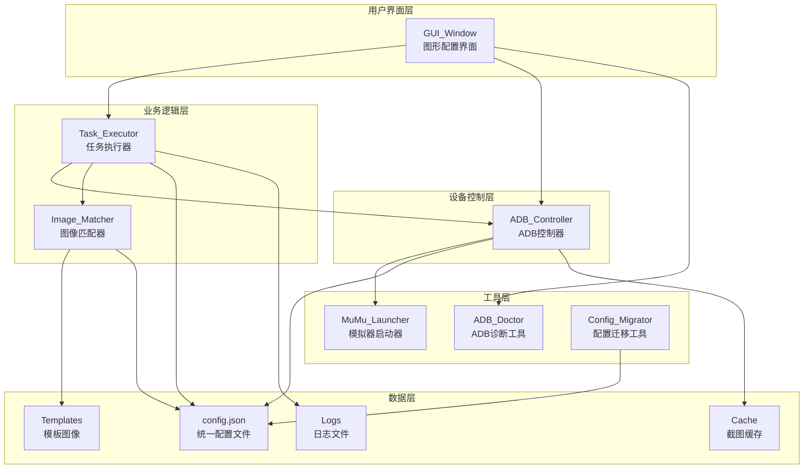

# 设计文档 - ADB 自动化测试框架

## 概述

ADB 自动化测试框架是一个基于 Python 的自动化测试工具，通过 ADB（Android Debug Bridge）连接和控制 MuMu 模拟器，实现图像识别、模板匹配和自动化任务执行。该框架采用模块化架构设计，提供图形化配置界面，支持游戏自动化测试、应用自动化操作和重复性任务自动执行。

### 设计目标

1. **模块化架构**: 将系统划分为 ADB 控制、图像匹配、任务执行、GUI 和工具五大模块，实现高内聚低耦合
2. **统一配置管理**: 使用单一 JSON 配置文件集中管理所有模块配置，简化配置维护
3. **可靠性**: 实现完善的错误处理和重试机制，提高系统稳定性
4. **易用性**: 提供图形化配置界面，降低使用门槛
5. **可扩展性**: 支持多种步骤类型和模板匹配算法，便于功能扩展
6. **可维护性**: 完善的日志记录系统，便于问题追踪和调试

### 技术栈

- **Python 3.x**: 主要开发语言
- **OpenCV (cv2)**: 图像处理和模板匹配
- **Pillow (PIL)**: 图像操作和格式转换
- **tkinter**: GUI 框架
- **subprocess**: 进程管理和 ADB 命令执行
- **json**: 配置文件处理
- **logging**: 日志系统
- **psutil**: 进程和端口管理
- **pywin32** (可选): Windows 窗口管理

## 架构

### 系统架构图



### 模块职责

#### 1. GUI 模块 (gui/)
- **config_window.py**: 主配置窗口，提供可视化配置和控制界面
- **config_window_patch.py**: 配置窗口补丁和扩展功能

职责：
- 提供用户交互界面
- 配置管理和验证
- 程序启动和停止控制
- 实时日志显示
- 线程管理和 UI 更新

#### 2. ADB 模块 (adb/)
- **adb_controller.py**: ADB 设备控制器

职责：
- 设备连接和断开
- 屏幕截图捕获
- 点击和滑动操作
- 设备状态管理
- 命令执行和超时控制

#### 3. OCR 模块 (ocr/)
- **image_matcher.py**: 图像匹配器

职责：
- 模板图像加载
- 图像模板匹配
- 匹配结果处理
- 调试图像生成

#### 4. Task 模块 (task/)
- **task_executor.py**: 任务执行器

职责：
- 任务配置加载
- 任务调度和执行
- 步骤执行控制
- 日志记录
- 错误处理和重试

#### 5. Utils 模块 (utils/)
- **mumu_launcher.py**: MuMu 模拟器智能启动器
- **adb_doctor.py**: ADB 连接诊断和修复工具
- **config_migrator.py**: 配置文件迁移工具

职责：
- 模拟器自动启动
- ADB 连接问题诊断
- 配置文件版本迁移
- 环境检查和修复


## 组件和接口

### ADBController 类

```python
class ADBController:
    """ADB设备控制器"""
    
    def __init__(self, config_path: str = "config/config.json")
        """初始化ADB控制器
        
        Args:
            config_path: 配置文件路径
        """
    
    def connect(self, device_ip: str = None) -> bool:
        """连接设备
        
        Args:
            device_ip: 设备IP地址和端口，格式为 "IP:PORT"
            
        Returns:
            bool: 连接是否成功
        """
    
    def wake_device(self) -> None:
        """唤醒设备屏幕"""
    
    def screenshot(self, save_path: str = None) -> bool:
        """截取屏幕
        
        Args:
            save_path: 截图保存路径
            
        Returns:
            bool: 截图是否成功
        """
    
    def tap(self, x: int, y: int) -> bool:
        """点击指定坐标
        
        Args:
            x: X坐标
            y: Y坐标
            
        Returns:
            bool: 点击是否成功
        """
    
    def swipe(self, x1: int, y1: int, x2: int, y2: int, duration: int = 300) -> bool:
        """滑动操作
        
        Args:
            x1: 起点X坐标
            y1: 起点Y坐标
            x2: 终点X坐标
            y2: 终点Y坐标
            duration: 滑动持续时间（毫秒）
            
        Returns:
            bool: 滑动是否成功
        """
    
    def get_screen_size(self) -> tuple[int, int]:
        """获取屏幕尺寸
        
        Returns:
            tuple: (宽度, 高度)，失败返回 (None, None)
        """
    
    def start_emulator(self) -> bool:
        """启动MuMu模拟器
        
        Returns:
            bool: 启动是否成功
        """
```

### ImageMatcher 类

```python
class ImageMatcher:
    """图像匹配器"""
    
    def __init__(self, config_path: str = "config/config.json")
        """初始化图像匹配器
        
        Args:
            config_path: 配置文件路径
        """
    
    def find_template(self, screenshot_path: str, template_name: str, 
                     threshold: float = None) -> dict:
        """在截图中查找模板
        
        Args:
            screenshot_path: 截图文件路径
            template_name: 模板文件名（相对于模板目录）
            threshold: 匹配阈值（0-1），None 使用配置值
            
        Returns:
            dict: 匹配结果，包含以下字段：
                - found: bool, 是否找到
                - confidence: float, 置信度
                - position: tuple, 中心坐标 (x, y)
                - top_left: tuple, 左上角坐标 (x, y)
                - size: tuple, 模板尺寸 (width, height)
            未找到返回 None
        """
    
    def find_all_templates(self, screenshot_path: str, template_name: str,
                          threshold: float = None) -> list[dict]:
        """查找所有匹配的模板
        
        Args:
            screenshot_path: 截图文件路径
            template_name: 模板文件名
            threshold: 匹配阈值
            
        Returns:
            list: 匹配结果列表，每个元素包含 position, top_left, size
        """
    
    def save_debug_image(self, screenshot_path: str, template_name: str,
                        result: dict, output_path: str = "debug/match_result.png") -> bool:
        """保存调试图像
        
        Args:
            screenshot_path: 截图文件路径
            template_name: 模板文件名
            result: 匹配结果
            output_path: 输出文件路径
            
        Returns:
            bool: 保存是否成功
        """
```

### TaskExecutor 类

```python
class TaskExecutor:
    """任务执行器"""
    
    def __init__(self, adb_controller: ADBController, image_matcher: ImageMatcher,
                 config_path: str = "config/config.json")
        """初始化任务执行器
        
        Args:
            adb_controller: ADB控制器实例
            image_matcher: 图像匹配器实例
            config_path: 配置文件路径
        """
    
    def execute_step(self, step: dict) -> bool:
        """执行单个步骤
        
        Args:
            step: 步骤定义，包含 action 和相关参数
            
        Returns:
            bool: 步骤是否执行成功
        """
    
    def execute_task(self, task_name: str) -> bool:
        """执行指定任务
        
        Args:
            task_name: 任务名称
            
        Returns:
            bool: 任务是否执行成功
        """
    
    def execute_all_tasks(self) -> None:
        """执行所有启用的任务"""
```

### MuMuLauncher 类

```python
class MuMuLauncher:
    """MuMu模拟器智能启动器"""
    
    def __init__(self, adb_path: str, mumu_path: str, target_port: int)
        """初始化启动器
        
        Args:
            adb_path: ADB工具路径
            mumu_path: MuMu模拟器路径
            target_port: 目标连接端口
        """
    
    def set_log_callback(self, callback: callable) -> None:
        """设置日志回调函数
        
        Args:
            callback: 日志回调函数，接受一个字符串参数
        """
    
    def launch_and_connect(self) -> bool:
        """启动模拟器并建立连接
        
        Returns:
            bool: 是否成功启动并连接
        """
```

### ADBDoctor 类

```python
class ADBDoctor:
    """ADB连接诊断医生"""
    
    def __init__(self, adb_path: str, mumu_path: str, target_port: int)
        """初始化诊断工具
        
        Args:
            adb_path: ADB工具路径
            mumu_path: MuMu模拟器路径
            target_port: 目标连接端口
        """
    
    def set_log_callback(self, callback: callable) -> None:
        """设置日志回调函数
        
        Args:
            callback: 日志回调函数，接受一个字符串参数
        """
    
    def diagnose_and_fix(self) -> bool:
        """诊断并修复ADB连接问题
        
        Returns:
            bool: 是否成功修复
        """
    
    def get_adb_path(self) -> str:
        """获取最终使用的ADB路径
        
        Returns:
            str: ADB工具路径
        """
```

### ConfigWindow 类

```python
class ConfigWindow:
    """配置窗口"""
    
    def __init__(self, config_path: str = "config/config.json")
        """初始化配置窗口
        
        Args:
            config_path: 配置文件路径
        """
    
    def run(self) -> None:
        """运行窗口主循环"""
```


## 数据模型

### 配置文件结构 (config.json)

```json
{
  "adb": {
    "adb_path": "string - ADB工具路径",
    "device_name": "string - 设备名称，用于多设备场景",
    "screenshot_path": "string - 截图保存路径",
    "connection_timeout": "number - 连接超时时间（秒）",
    "retry_times": "number - 重试次数",
    "click_delay": "number - 点击后延迟时间（秒）"
  },
  "emulator": {
    "mumu_path": "string - MuMu模拟器路径",
    "mumu_port": "number - 模拟器连接端口",
    "auto_start_emulator": "boolean - 是否自动启动模拟器"
  },
  "ocr": {
    "template_match_threshold": "number - 模板匹配阈值（0-1）",
    "template_dir": "string - 模板图像目录"
  },
  "task": {
    "task_interval": "number - 任务间隔时间（秒）",
    "max_retry": "number - 最大重试次数",
    "tasks": [
      {
        "name": "string - 任务名称",
        "enabled": "boolean - 是否启用",
        "steps": [
          {
            "action": "string - 步骤类型",
            "...": "其他参数"
          }
        ]
      }
    ]
  }
}
```

### 配置示例

```json
{
  "adb": {
    "adb_path": "C:/MuMuPlayer-12.0/shell/adb.exe",
    "device_name": "",
    "screenshot_path": "cache/screenshot.png",
    "connection_timeout": 30,
    "retry_times": 3,
    "click_delay": 0.5
  },
  "emulator": {
    "mumu_path": "C:/MuMuPlayer-12.0/shell/MuMuPlayer.exe",
    "mumu_port": 16384,
    "auto_start_emulator": true
  },
  "ocr": {
    "template_match_threshold": 0.8,
    "template_dir": "resource/templates"
  },
  "task": {
    "task_interval": 1,
    "max_retry": 3,
    "tasks": [
      {
        "name": "daily_task",
        "enabled": true,
        "steps": [
          {
            "action": "find_and_click",
            "template": "start_button.png",
            "timeout": 10,
            "max_retry": 3
          },
          {
            "action": "wait",
            "duration": 2
          },
          {
            "action": "screenshot"
          }
        ]
      }
    ]
  }
}
```

### 步骤类型定义

#### 1. find_and_click 步骤

查找模板图像并点击其中心位置。

```json
{
  "action": "find_and_click",
  "template": "button.png",
  "timeout": 10,
  "max_retry": 3
}
```

参数：
- `template` (string): 模板图像文件名
- `timeout` (number): 超时时间（秒）
- `max_retry` (number): 最大重试次数

#### 2. wait 步骤

等待指定时间。

```json
{
  "action": "wait",
  "duration": 2
}
```

参数：
- `duration` (number): 等待时间（秒）

#### 3. screenshot 步骤

捕获屏幕截图。

```json
{
  "action": "screenshot"
}
```

无额外参数。

### 匹配结果数据结构

```python
{
    "found": True,              # 是否找到匹配
    "confidence": 0.95,         # 置信度（0-1）
    "position": (320, 240),     # 中心坐标 (x, y)
    "top_left": (270, 190),     # 左上角坐标 (x, y)
    "size": (100, 100)          # 模板尺寸 (width, height)
}
```

### 日志文件格式

日志文件命名：`task_YYYYMMDD.log`

日志格式：
```
2024-01-15 10:30:45,123 - INFO - 开始执行任务: daily_task
2024-01-15 10:30:45,456 - INFO - 执行步骤 1/3
2024-01-15 10:30:46,789 - INFO - 找到模板 start_button.png，位置: (320, 240), 置信度: 0.95
2024-01-15 10:30:47,012 - INFO - 点击成功: (320, 240)
2024-01-15 10:30:49,345 - INFO - 任务执行完成: daily_task
```

### 目录结构

```
project/
├── Python/                     # 源代码目录
│   ├── adb/                   # ADB模块
│   │   ├── __init__.py
│   │   └── adb_controller.py
│   ├── ocr/                   # OCR模块
│   │   ├── __init__.py
│   │   └── image_matcher.py
│   ├── task/                  # 任务模块
│   │   ├── __init__.py
│   │   └── task_executor.py
│   ├── gui/                   # GUI模块
│   │   ├── __init__.py
│   │   ├── config_window.py
│   │   └── config_window_patch.py
│   ├── utils/                 # 工具模块
│   │   ├── __init__.py
│   │   ├── mumu_launcher.py
│   │   ├── adb_doctor.py
│   │   └── config_migrator.py
│   └── main.py               # 主程序入口
├── config/                    # 配置目录
│   ├── config.json           # 统一配置文件
│   └── backup/               # 配置备份目录
├── resource/                  # 资源目录
│   ├── templates/            # 模板图像目录
│   └── icon.ico              # 程序图标
├── cache/                     # 缓存目录
│   └── screenshot.png        # 截图缓存
├── debug/                     # 调试目录
│   └── match_result.png      # 匹配结果图像
└── data/                      # 数据目录
    └── task_YYYYMMDD.log     # 日志文件
```


## 正确性属性

*属性是一个特征或行为，应该在系统的所有有效执行中保持为真——本质上是关于系统应该做什么的形式化陈述。属性作为人类可读规范和机器可验证正确性保证之间的桥梁。*

### 属性 1: 连接重试机制

*对于任何* 有效的设备地址和配置的重试次数 N，当连接失败时，系统应该尝试连接最多 N 次，然后返回失败状态。

**验证需求: 1.2, 12.2**

### 属性 2: 命令超时终止

*对于任何* ADB 命令和配置的超时时间 T，如果命令执行时间超过 T 秒，系统应该终止命令执行并返回超时错误。

**验证需求: 1.3, 12.1, 18.3**

### 属性 3: 连接状态验证

*对于任何* 连接尝试，系统应该返回明确的布尔结果（成功或失败），并且该结果应该与实际的设备连接状态一致。

**验证需求: 1.4**

### 属性 4: 屏幕尺寸获取

*对于任何* 已连接的设备，调用获取屏幕尺寸方法应该返回有效的宽度和高度值（正整数），或者在失败时返回 (None, None)。

**验证需求: 1.6**

### 属性 5: 端口到索引计算

*对于任何* 符合 MuMu 端口规则的端口号 P（P >= 16384 且 (P - 16384) % 32 == 0），计算的索引应该等于 (P - 16384) / 32。

**验证需求: 2.2, 14.2**

### 属性 6: 端口监听等待

*对于任何* 目标端口和最大等待时间 T，如果端口在 T 秒内开始监听，系统应该在检测到后立即返回成功；如果超过 T 秒端口仍未监听，系统应该返回超时失败。

**验证需求: 2.3**

### 属性 7: 模拟器启动幂等性

*对于任何* 模拟器实例，如果模拟器已经在运行（端口已监听），调用启动方法应该跳过启动步骤并直接尝试连接，而不是启动新实例。

**验证需求: 2.4**

### 属性 8: ADB 进程清理

*对于任何* 启动或诊断操作，在执行前系统应该结束所有现有的 adb.exe 进程，确保没有进程冲突。

**验证需求: 2.5, 9.3**

### 属性 9: 截图文件创建

*对于任何* 有效的保存路径，成功的截图操作应该在指定路径创建一个非空的图像文件。

**验证需求: 3.1, 3.2, 3.4**

### 属性 10: 目录自动创建

*对于任何* 不存在的目录路径，当系统需要在该路径下保存文件时，应该自动创建所有必要的父目录。

**验证需求: 3.3, 16.5**

### 属性 11: 模板匹配阈值判断

*对于任何* 截图、模板和阈值 T，如果匹配置信度 >= T，系统应该返回匹配成功结果；如果置信度 < T，系统应该返回 None 或空列表。

**验证需求: 4.3**

### 属性 12: 匹配结果完整性

*对于任何* 成功的模板匹配，返回的结果应该包含所有必需字段：found、confidence、position、top_left 和 size，且所有坐标和尺寸值应该是非负整数。

**验证需求: 4.4**

### 属性 13: 多匹配查找

*对于任何* 截图和模板，find_all_templates 方法返回的匹配数量应该 >= find_template 方法的匹配数量（0 或 1）。

**验证需求: 4.5**

### 属性 14: 点击延迟

*对于任何* 点击操作和配置的延迟时间 D，系统应该在执行点击后等待至少 D 秒再返回。

**验证需求: 5.2**

### 属性 15: 滑动持续时间

*对于任何* 滑动操作和指定的持续时间 T，系统应该使用该持续时间参数执行滑动命令。

**验证需求: 5.4**

### 属性 16: 配置文件往返

*对于任何* 有效的配置对象，将其保存到文件然后重新加载，应该得到等价的配置对象（所有字段值相同）。

**验证需求: 7.1, 10.2**

### 属性 17: 任务顺序执行

*对于任何* 包含 N 个步骤的任务，系统应该按照步骤在配置中的顺序（索引 0 到 N-1）依次执行，不跳过或重排。

**验证需求: 6.2**

### 属性 18: 查找并点击重试

*对于任何* "find_and_click" 步骤，如果模板未找到且未超时，系统应该重复"截图-匹配-检查"循环，直到找到模板或达到超时时间。

**验证需求: 6.4, 12.4**

### 属性 19: 禁用任务跳过

*对于任何* enabled 字段为 false 的任务，系统应该跳过该任务的所有步骤，不执行任何操作。

**验证需求: 6.5**

### 属性 20: 步骤失败终止

*对于任何* 任务，如果某个步骤执行失败，系统应该立即终止该任务，不执行后续步骤，并返回失败状态。

**验证需求: 6.6**

### 属性 21: 日志双重输出

*对于任何* 日志消息，系统应该同时将其写入日志文件和输出到控制台（或 GUI 日志区域）。

**验证需求: 11.1**

### 属性 22: 日志文件命名

*对于任何* 日期，系统创建的日志文件名应该符合格式 "task_YYYYMMDD.log"，其中 YYYY 是年份，MM 是月份，DD 是日期。

**验证需求: 11.2**

### 属性 23: 日志内容完整性

*对于任何* 任务执行，日志应该包含任务开始、每个步骤执行、成功/失败状态和任务完成的记录，每条记录包含时间戳和日志级别。

**验证需求: 11.4, 11.5**

### 属性 24: 版本到端口映射

*对于任何* 检测到的 MuMu 版本号 V，系统应该根据映射规则返回对应的默认端口：版本 6 和 9 映射到 7555，版本 12 映射到 16384。

**验证需求: 9.2**

### 属性 25: 端口占用检测

*对于任何* 目标端口 P，系统应该能够检测该端口是否被占用，如果被占用应该返回占用该端口的进程信息。

**验证需求: 9.4**

### 属性 26: ADB 工具查找

*对于任何* MuMu 安装路径，系统应该能够在预定义的相对路径列表中查找 MuMu 自带的 ADB 工具，如果找到应该返回完整路径。

**验证需求: 9.6**

### 属性 27: 配置迁移备份

*对于任何* 成功的配置迁移操作，系统应该将旧配置文件备份到 config/backup 目录，备份文件应该保留原始内容。

**验证需求: 10.4**

### 属性 28: 配置验证完整性

*对于任何* 启动尝试，系统应该验证所有必填配置项（adb_path、mumu_path、mumu_port）是否已配置且有效，只有全部验证通过才允许启动。

**验证需求: 13.1, 13.2, 13.3, 13.4, 13.5**

### 属性 29: 端口范围验证

*对于任何* 端口号输入，系统应该验证其是否在有效范围 1024-65535 内，超出范围应该拒绝并显示错误消息。

**验证需求: 13.2**

### 属性 30: 设备名称参数传递

*对于任何* 配置了 device_name 的情况，系统执行的所有 ADB 命令应该包含 "-s {device_name}" 参数来指定目标设备。

**验证需求: 14.4**

### 属性 31: 模板文件加载

*对于任何* 存在于模板目录中的有效图像文件，系统应该能够成功加载；对于不存在的文件，系统应该返回 None 并记录警告日志。

**验证需求: 15.1, 15.3**

### 属性 32: 相对路径处理

*对于任何* 模板文件名，系统应该将其解释为相对于配置的 template_dir 的路径，而不是绝对路径。

**验证需求: 15.4**

### 属性 33: GUI 状态锁定

*对于任何* 程序运行状态，当程序正在运行时，所有配置输入框和配置相关按钮应该被禁用；当程序停止时，应该被重新启用。

**验证需求: 8.6, 17.5**

### 属性 34: 停止标志传播

*对于任何* 正在执行的任务，当用户点击停止按钮时，系统应该设置 stop_flag 为 True，任务执行循环应该在下一次检查时检测到该标志并终止执行。

**验证需求: 8.9, 17.4**

### 属性 35: 路径分隔符处理

*对于任何* 文件路径操作，系统应该正确处理 Windows 路径分隔符（反斜杠），确保路径在 Windows 系统上有效。

**验证需求: 19.2**

### 属性 36: 可选依赖处理

*对于任何* 使用 pywin32 库的功能，如果库不可用，系统应该捕获 ImportError 异常并继续运行，只是跳过依赖该库的功能。

**验证需求: 19.5**

### 属性 37: 任务间隔时间

*对于任何* 连续的两个任务，系统应该在第一个任务完成后等待配置的 task_interval 秒，然后再开始执行第二个任务。

**验证需求: 20.4**


## 错误处理

### 错误处理策略

系统采用分层错误处理策略，确保错误能够被正确捕获、记录和处理。

#### 1. 命令执行层错误

**ADB 命令执行错误**:
- 超时错误：使用 subprocess.run 的 timeout 参数，超时后抛出 TimeoutExpired 异常
- 命令失败：检查返回码，非零返回码表示失败
- 处理方式：捕获异常，记录错误日志，返回失败状态

```python
try:
    result = subprocess.run(
        command,
        timeout=self.connection_timeout,
        capture_output=True
    )
    return result.returncode == 0, result.stdout, result.stderr
except subprocess.TimeoutExpired:
    logger.error(f"命令超时: {command}")
    return False, "", "Timeout"
except Exception as e:
    logger.error(f"命令执行失败: {e}")
    return False, "", str(e)
```

#### 2. 文件操作层错误

**文件不存在错误**:
- 配置文件不存在：返回空配置对象，使用默认值
- 模板文件不存在：返回 None，记录警告日志
- 截图文件不存在：返回 False，记录错误日志

**目录创建错误**:
- 使用 Path.mkdir(parents=True, exist_ok=True) 自动创建目录
- 捕获权限错误，记录错误日志

```python
try:
    Path(save_path).parent.mkdir(parents=True, exist_ok=True)
except PermissionError:
    logger.error(f"无权限创建目录: {save_path}")
    return False
```

#### 3. 图像处理层错误

**图像加载错误**:
- 文件格式不支持：cv2.imread 返回 None
- 文件损坏：cv2.imread 返回 None
- 处理方式：检查返回值，记录警告，返回 None

**模板匹配错误**:
- 图像尺寸不匹配：OpenCV 自动处理
- 匹配失败：返回低置信度结果
- 处理方式：根据阈值判断，返回 None 或匹配结果

#### 4. 任务执行层错误

**步骤执行失败**:
- 截图失败：重试配置的次数
- 模板未找到：在超时时间内持续重试
- 点击失败：记录错误，终止任务
- 处理方式：根据步骤类型决定是否重试，失败后终止任务

```python
def execute_step(self, step):
    try:
        action = step.get("action")
        if action == "find_and_click":
            return self._find_and_click(step)
        elif action == "wait":
            time.sleep(step.get("duration", 1))
            return True
        elif action == "screenshot":
            return self.adb.screenshot()
        return False
    except Exception as e:
        self.logger.error(f"步骤执行异常: {e}")
        return False
```

#### 5. GUI 层错误

**配置验证错误**:
- 必填项为空：显示错误对话框，阻止启动
- 端口号无效：显示错误对话框，阻止启动
- 文件不存在：显示错误对话框，阻止启动

**线程执行错误**:
- 捕获工作线程中的所有异常
- 使用 root.after 安全更新 UI
- 显示错误状态和错误消息

```python
def _run_main_program(self):
    try:
        # 执行主程序逻辑
        ...
    except Exception as e:
        self._log(f"错误: {e}")
        import traceback
        self._log(traceback.format_exc())
        self._on_program_error()
```

### 重试机制

#### 连接重试
- 最大重试次数：由配置文件指定（默认 3 次）
- 重试间隔：2 秒
- 失败条件：达到最大重试次数后返回失败

#### 截图重试
- 最大重试次数：由步骤配置指定
- 重试间隔：1 秒
- 失败条件：达到最大重试次数或超时

#### 模板匹配重试
- 最大重试次数：无限制，由超时时间控制
- 重试间隔：由配置的 task_interval 指定
- 失败条件：达到超时时间

### 日志记录

所有错误都应该被记录到日志文件，包含以下信息：
- 时间戳
- 日志级别（ERROR, WARNING, INFO）
- 错误消息
- 堆栈跟踪（对于异常）

```python
logger.error(f"连接失败: {device_ip}, 错误: {stderr}")
logger.warning(f"未找到模板: {template_name}")
logger.info(f"任务执行完成: {task_name}")
```


## 测试策略

### 测试方法

系统采用双重测试方法，结合单元测试和基于属性的测试，确保全面的测试覆盖。

#### 单元测试
单元测试用于验证特定示例、边界情况和错误条件：
- 特定配置值的验证
- 边界情况（空输入、无效输入）
- 错误处理路径
- 集成点测试

#### 基于属性的测试
基于属性的测试用于验证通用属性在所有输入下都成立：
- 使用随机生成的输入
- 验证正确性属性
- 每个测试至少运行 100 次迭代
- 覆盖广泛的输入空间

### 测试框架

**Python 测试框架**:
- **pytest**: 单元测试框架
- **Hypothesis**: 基于属性的测试库
- **unittest.mock**: 模拟外部依赖（ADB 命令、文件系统）

### 测试组织

```
Python/
├── test_adb.py           # ADB 控制器测试
├── test_ocr.py           # 图像匹配器测试
├── test_task.py          # 任务执行器测试
└── tests/                # 额外测试文件
    ├── test_mumu_launcher.py
    ├── test_adb_doctor.py
    └── test_config_migrator.py
```

### 属性测试示例

#### 属性 5: 端口到索引计算

```python
from hypothesis import given, strategies as st
import pytest

@given(st.integers(min_value=0, max_value=100))
def test_port_to_index_calculation(index):
    """
    Feature: adb-automation-framework, Property 5: 
    对于任何符合 MuMu 端口规则的端口号，计算的索引应该等于 (P - 16384) / 32
    """
    port = 16384 + index * 32
    launcher = MuMuLauncher("", "", port)
    calculated_index = launcher._calculate_index()
    assert calculated_index == index
```

#### 属性 11: 模板匹配阈值判断

```python
@given(
    st.floats(min_value=0.0, max_value=1.0),  # 置信度
    st.floats(min_value=0.0, max_value=1.0)   # 阈值
)
def test_template_matching_threshold(confidence, threshold):
    """
    Feature: adb-automation-framework, Property 11:
    如果匹配置信度 >= 阈值，应该返回匹配成功；否则返回 None
    """
    # 模拟匹配结果
    mock_result = create_mock_match_result(confidence)
    
    if confidence >= threshold:
        assert mock_result is not None
        assert mock_result["found"] == True
        assert mock_result["confidence"] == confidence
    else:
        assert mock_result is None
```

#### 属性 16: 配置文件往返

```python
@given(st.builds(
    dict,
    adb_path=st.text(min_size=1),
    mumu_port=st.integers(min_value=1024, max_value=65535),
    template_threshold=st.floats(min_value=0.0, max_value=1.0)
))
def test_config_roundtrip(config_data):
    """
    Feature: adb-automation-framework, Property 16:
    配置保存后重新加载应该得到等价的配置对象
    """
    config_path = "test_config.json"
    
    # 保存配置
    with open(config_path, 'w', encoding='utf-8') as f:
        json.dump(config_data, f, indent=2)
    
    # 加载配置
    with open(config_path, 'r', encoding='utf-8') as f:
        loaded_config = json.load(f)
    
    # 验证等价性
    assert loaded_config == config_data
    
    # 清理
    os.remove(config_path)
```

#### 属性 17: 任务顺序执行

```python
@given(st.lists(
    st.builds(dict, action=st.sampled_from(["wait", "screenshot"])),
    min_size=1,
    max_size=10
))
def test_task_execution_order(steps):
    """
    Feature: adb-automation-framework, Property 17:
    任务步骤应该按照配置中的顺序依次执行
    """
    execution_order = []
    
    def mock_execute_step(step):
        execution_order.append(step)
        return True
    
    task = {"name": "test_task", "enabled": True, "steps": steps}
    executor = TaskExecutor(mock_adb, mock_matcher)
    executor.execute_step = mock_execute_step
    
    executor.execute_task("test_task")
    
    # 验证执行顺序
    assert execution_order == steps
```

### 单元测试示例

#### 测试设备唤醒功能

```python
def test_wake_device_when_asleep():
    """测试设备休眠时的唤醒功能"""
    adb = ADBController()
    
    # 模拟设备休眠状态
    with mock.patch.object(adb, '_execute_command') as mock_exec:
        mock_exec.side_effect = [
            (True, "mWakefulness=Asleep", ""),  # 检查状态
            (True, "", ""),                      # 按电源键
            (True, "", "")                       # 滑动解锁
        ]
        
        adb.wake_device()
        
        # 验证调用了唤醒命令
        assert mock_exec.call_count == 3
```

#### 测试配置验证

```python
def test_config_validation_missing_required_fields():
    """测试缺少必填字段时的配置验证"""
    window = ConfigWindow()
    
    # 设置不完整的配置
    window.adb_path_entry.insert(0, "")
    window.mumu_path_entry.insert(0, "path/to/mumu")
    window.mumu_port_entry.insert(0, "16384")
    
    # 尝试启动应该失败
    with pytest.raises(ValueError):
        window._validate_config()
```

#### 测试端口范围验证

```python
@pytest.mark.parametrize("port,expected_valid", [
    (1023, False),    # 低于最小值
    (1024, True),     # 最小有效值
    (16384, True),    # MuMu 默认端口
    (65535, True),    # 最大有效值
    (65536, False),   # 超过最大值
    (-1, False),      # 负数
])
def test_port_validation(port, expected_valid):
    """测试端口号验证"""
    window = ConfigWindow()
    is_valid = window._validate_port(port)
    assert is_valid == expected_valid
```

### 模拟和测试替身

#### ADB 命令模拟

```python
class MockADBController:
    """模拟 ADB 控制器，用于测试"""
    
    def __init__(self):
        self.connected = False
        self.screenshots = []
        self.clicks = []
    
    def connect(self, device_ip=None):
        self.connected = True
        return True
    
    def screenshot(self, save_path=None):
        self.screenshots.append(save_path)
        return True
    
    def tap(self, x, y):
        self.clicks.append((x, y))
        return True
```

#### 图像匹配模拟

```python
class MockImageMatcher:
    """模拟图像匹配器，用于测试"""
    
    def __init__(self, match_results=None):
        self.match_results = match_results or {}
    
    def find_template(self, screenshot_path, template_name, threshold=None):
        return self.match_results.get(template_name)
```

### 测试覆盖目标

- **代码覆盖率**: 目标 80% 以上
- **分支覆盖率**: 目标 70% 以上
- **属性测试**: 每个正确性属性至少一个测试
- **边界测试**: 所有边界条件都有测试用例

### 持续集成

建议的 CI 配置：

```yaml
# .github/workflows/test.yml
name: Tests

on: [push, pull_request]

jobs:
  test:
    runs-on: windows-latest
    
    steps:
    - uses: actions/checkout@v2
    
    - name: Set up Python
      uses: actions/setup-python@v2
      with:
        python-version: '3.9'
    
    - name: Install dependencies
      run: |
        pip install -r requirements.txt
        pip install pytest hypothesis pytest-cov
    
    - name: Run tests
      run: |
        pytest --cov=Python --cov-report=html --cov-report=term
    
    - name: Upload coverage
      uses: codecov/codecov-action@v2
```

### 测试数据

#### 测试模板图像
- 创建简单的测试模板（纯色矩形、简单图案）
- 使用已知的匹配位置和置信度
- 测试不同尺寸和格式的图像

#### 测试配置
- 有效配置示例
- 无效配置示例（缺少字段、错误类型）
- 边界值配置（最小/最大端口号）

#### 测试任务
- 简单任务（单步骤）
- 复杂任务（多步骤）
- 失败场景（不存在的模板）

### 性能测试

虽然性能需求不适合单元测试，但应该进行性能基准测试：

```python
def test_screenshot_performance():
    """基准测试：截图性能"""
    adb = ADBController()
    adb.connect()
    
    start_time = time.time()
    success = adb.screenshot()
    elapsed = time.time() - start_time
    
    assert success
    assert elapsed < 5.0  # 应该在 5 秒内完成
    print(f"截图耗时: {elapsed:.2f} 秒")
```

### 测试执行

```bash
# 运行所有测试
pytest

# 运行特定测试文件
pytest test_adb.py

# 运行属性测试（更多迭代）
pytest --hypothesis-iterations=1000

# 生成覆盖率报告
pytest --cov=Python --cov-report=html

# 运行特定标记的测试
pytest -m "property_test"
```

